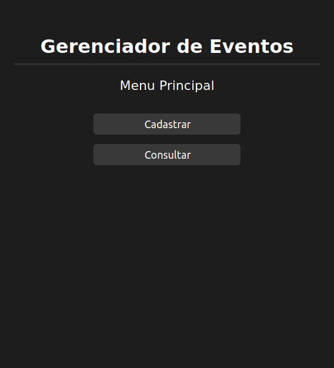
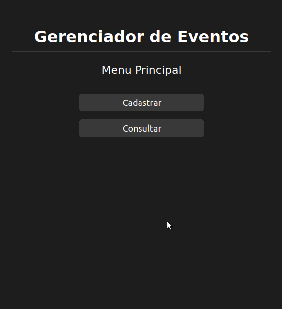
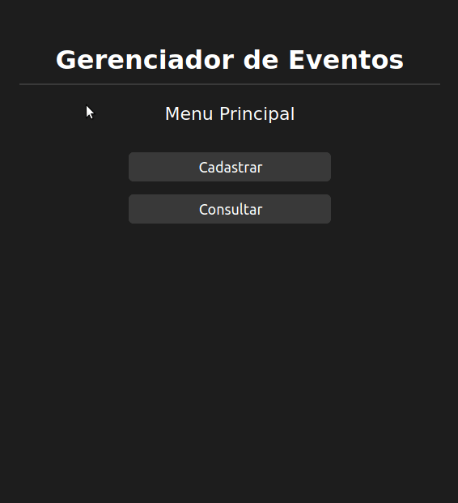

# Desafio Programa Go Dev

## Problema
Será realizado um treinamento para uma grande empresa de TI especializada em softwares de gestão. O treinamento será realizado em 2 etapas e as pessoas serão divididas em salas com lotação variável. Serão realizados também dois intervalos de café em 2 espaços distintos. Você precisa criar o sistema que gerenciará este evento.

## Projeto
### Sistema desenvolvido
O sistema desenvolvimento consiste em uma aplicação de gerenciamento de eventos, que permite:
* O cadastro de pessoas, com nome e sobrenome;
* O cadastro de salas de evento, com nome e lotação;
* O cadastro de espaços de café, com nome e lotação;
* A consulta de cada pessoa;
* A consulta de cada sala de evento e espaço de café.

Além disso, seguindo as instruções do problema proposto, as pessoas cadastradas são distribuidas nas salas e espaços de café considerando que:
* A diferença de pessoas em cada sala deverá ser de no máximo 1 pessoa;
* Metade das pessoas precisam trocar de sala entre as duas etapas de treinamento.

### Interface
A interface inicial permite ao usuário navegar para duas outras interfaces: Cadastro e Consulta.

#### Cadastro
Na interface de cadastro é possível realizar o cadastro de:
* Pessoas, com nome e sobrenome;
* Salas de Evento, com nome e lotação;
* Espaços de Café, com nome e lotação.

Observações: 
1) Vale ressaltar que, conforme especificado no enunciado do problema, o número de Espaços de Café é limitado a 2.
2) O número de pessoas cadastradas é limitada pela lotação máxima das salas e também pela especificação de que a diferença de pessoas em cada sala é de no máximo 1 pessoa.

#### Consulta
Nesta interface o usuário pode consultar pessoas, salas e espaços de café previamente cadastrados.
* Ao consultar uma Pessoa, serão disponibilizadas as salas em que a pessoa ficará em cada etapa e o espaço onde ela realizará cada intervalo de café;
* Ao consultar uma Sala ou Espaço de Café, será disponibilizada uma lista contendo as pessoas que estarão naquela sala/espaço em cada etapa do evento.

## Tecnologias
As seguintes tecnologias foram utilizadas para o desenvolvimento da aplicação:
* HTML
* CSS
* Python
  * Flask 
  * SQLAlchemy

## Organização
Os arquivos da projeto desenvolvido estão organizados da seguinte maneira:

    .
    ├── imgs
    │   └── animacoes                    # 'Gifs' animados do funcionamento da aplicação
    |       ├── consulta.gif
    |       └── cadastro.gif
    ├── imgs
    │   └── screenshots                  # 'Screenshots' do funcionamento da aplicação
    |       ├── menu-principal.png
    |       ├── menu-cadastro.png
    |       ├── menu-consulta.png
    |       ├── cadastro-pessoa.png
    |       ├── cadastro-sala-evento.png
    |       ├── cadastro-espaco-cafe.png
    |       ├── consulta-pessoa.png
    |       ├── consulta-pessoa-selecionada.png
    |       ├── consulta-sala-evento.png
    |       ├── consulta-sala-evento-selecionada.png
    |       ├── consulta-espaco-cafe.png
    |       └── consulta-espaco-cafe-selecionado.png
    ├── static
    |   └── css           
    |        └── main.css                # Arquivo de estilo (.css) da aplicação web
    ├── templates                        # 'Templates' da interface web da aplicação
    |       ├── base.html                
    |       ├── cadastro.html        
    |       ├── cadastro-espaco-cafe.html        
    |       ├── cadastro-pessoa.html
    |       ├── cadastro-sala-evento.html
    |       ├── consulta.html
    |       ├── consulta-espaco-cafe.html
    |       ├── consulta-espaco-cafe-selecionado.html
    |       ├── consulta-pessoa.html
    |       ├── consulta-pessoa-selecionada.html
    |       ├── consulta-sala-evento.html
    |       ├── consulta-sala-evento-selecionada.html
    |       └── index.html              # Interface principal da aplicação
    ├── app.py                          # Aplicação principal
    ├── classes.py                      # Classes e Modelos do Banco de dados
    ├── funcoes.py                      # Principais funções da aplicação
    ├── espacoscafe.db                  # Banco de dados contendo todos os Espaços de Café cadastrados
    ├── pessoas.db                      # Banco de dados contendo todas as Pessoas cadastradas
    ├── salasevento.db                  # Banco de dados contendo todas as Salas de Evento cadastradas
    └── README.md                       # Documentação

## Execução
Para executar a aplicação:
